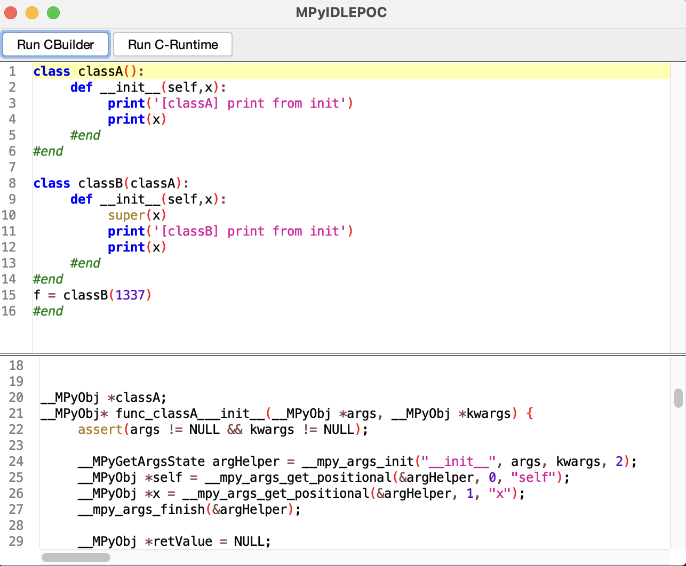

# Mini-Python Builder (Frontend)

## Disclaimer
This repository does not contain the actual source code. It is the task of students to create a frontend during the semester in the module compiler-construction. The code is kept private so nobody gains a advantage when finding this repository. 

## Overview
1. This repository usually provides a grammar file Grammar.g4 that tries to reflect the language specifications of mini-python [syntax_definition](https://github.com/Compiler-CampusMinden/Mini-Python-Builder/blob/master/docs/syntax_definition.md)
2. a GrammarListener.java class that is able to call the right CBuilder API calls for a recognized language specification from the user input
3. a minimalistic user interface
4. and system tests written with mini-python syntax

## Screenshot User Interface

